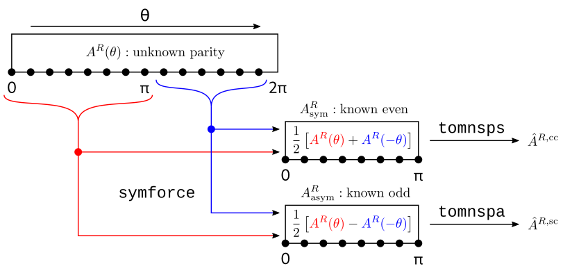

# vmec-internals
Some VMEC-internal documentation...

* documentation of input parameters, version history of VMEC: [vmec_info.md](https://github.com/jonathanschilling/educational_VMEC/blob/master/vmec_info.md)
* Scalar quantities (# of Fourier modes, grid sizes, ...): [scalars.pdf](https://github.com/jonathanschilling/vmec-internals/blob/master/scalars.pdf)
* Contents of the `mgrid` file: [mgrid_file.md](https://github.com/jonathanschilling/vmec-internals/blob/master/mgrid_file.md)
* Contents of the `wout` file: [vmec_var_names.pdf](https://github.com/jonathanschilling/vmec-internals/blob/master/vmec_var_names.pdf)

## Talks
* [Spectral Condensation](https://github.com/jonathanschilling/vmec-internals/blob/master/2021_05_04_Spectral_Condensation_in_VMEC_Schilling.pdf)
* [Radial Preconditioner](https://github.com/jonathanschilling/vmec-internals/blob/master/2021_10_20_RadialPreconditioner.pdf)

## Fourier transforms

This is copied here from [https://github.com/ORNL-Fusion/PARVMEC/issues/21].

The following two sketches illustrate how the inverse Fourier transforms of the geometry to real space in `totzsp*` are setup
in the asymmetric case (with `symrzl` to extend quantities to the full poloidal interval in the asymmetric case):

The following two sketches illustrate how the forward Fourier transforms/integrals of the forces to Fourier space in `tomnsp` are setup in the asymmetric case (with `symforce` to decompose the forces on the full poloidal interval into definite-parity contributions on the reduced poloidal interval):

